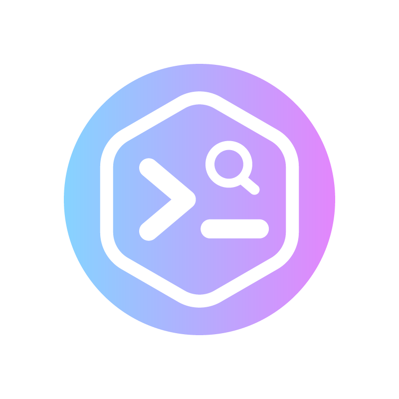

# CodeWeave AI

**Semantic codebase search and AI-powered code understanding — fully offline, completely free.**

Ask anything about your codebase. CodeWeave indexes your project locally using [Ollama](https://ollama.com) and answers your questions by finding the most relevant code — no internet, no API key, no subscription.



---

# ✨ Features

- **100% local & offline** — Your code never leaves your machine. No API keys, no cloud sync, no rate limits
- **Natural language Q&A** — Ask questions like _“how does authentication work?”_ or _“where is the retry logic?”_ and get accurate, source-linked answers
- **Semantic search** — Find code by meaning, not just keyword matching
- **GraphRAG-powered retrieval** — Understands function calls, imports, dependencies, and class hierarchies for deeper code awareness
- **AI-powered explanations** — Explain functions, trace execution flows, and summarize modules instantly
- **@mention context pinning** — Use `@filename.ts` or `@FunctionName` to force-include specific files or symbols in context
- **Clickable source citations** — Every response links directly to the exact file and line range
- **Streaming responses** — Answers appear token-by-token in real time
- **Multi-turn conversations** — Remembers recent context for natural follow-up questions
- **Auto re-indexing on save** — Updated files are automatically re-embedded in the background
- **Stale index detection** — Detects when indexed files have changed and need refreshing
- **Folder structure queries** — Ask for project structure and get a real directory tree view
- **Click-to-navigate** — Jump directly from answers to source code locations

---

## 🚀 Getting Started

### 1. Install Ollama

Download and install Ollama from [ollama.com/download](https://ollama.com/download), then start it:

```bash
ollama serve
```

### 2. Pull the required models

```bash
ollama pull qwen2.5-coder:7b
ollama pull mxbai-embed-large
```

> First-time download is ~4–5 GB total. Only needed once.

### 3. Open a project and index it

Open any project folder in VS Code, then either:

- Click **Index Codebase** in the CodeWeave sidebar, or
- Run `CodeWeave: Index Codebase` from the Command Palette (`Cmd/Ctrl+Shift+P`)

### 4. Ask questions

Type anything in the chat panel:

```
How does authentication work?
Where is the database connection initialized?
Explain the risk manager module
@retriever.ts what does the retrieve function do?
Show me the folder structure
```

---

## 💬 Example Questions

| Question                             | What CodeWeave does                                           |
| ------------------------------------ | ------------------------------------------------------------- |
| `How does auth work?`                | Finds auth-related functions, traces the call graph           |
| `Where are API calls made?`          | Locates all HTTP fetch/axios calls across the codebase        |
| `Explain the indexer`                | Summarises the indexer module with code references            |
| `@lancedb.ts what does search() do?` | Pins lancedb.ts and explains the search function specifically |
| `Show me the project structure`      | Renders a real file tree from the workspace                   |
| `What calls the embed function?`     | Uses the knowledge graph to trace callers                     |

---

## ⚙️ Configuration

All settings are under `CodeWeave AI` in VS Code settings (`Cmd/Ctrl+,`):

| Setting                       | Default                   | Description                                         |
| ----------------------------- | ------------------------- | --------------------------------------------------- |
| `codeweave.ollamaUrl`         | `http://localhost:11434`  | Ollama server URL                                   |
| `codeweave.chatModel`         | `qwen2.5-coder:7b`        | Model for answering questions                       |
| `codeweave.embedModel`        | `mxbai-embed-large`       | Model for embeddings (do not change after indexing) |
| `codeweave.chunkSize`         | `30`                      | Lines per chunk when indexing                       |
| `codeweave.topK`              | `5`                       | Code chunks retrieved per question                  |
| `codeweave.includeExtensions` | `.ts, .py, .go, ...`      | File types to index                                 |
| `codeweave.excludePaths`      | `node_modules, .git, ...` | Folders to skip                                     |

### Alternative models

**Chat models** (set `codeweave.chatModel`):

```
ollama pull codellama          # Meta's code model, good for C/C++/Python
ollama pull deepseek-coder:6.7b  # Strong at code explanation
ollama pull mistral            # Fast general-purpose model
ollama pull llama3.2:3b        # Lightweight, good for smaller machines
```

**Embedding models** (set `codeweave.embedModel`):

```
ollama pull nomic-embed-text   # Lighter alternative to mxbai-embed-large
```

> ⚠️ Changing the embed model after indexing requires clearing and re-indexing (`CodeWeave: Clear Index`).

---

## 📁 Custom Ignore Rules

Create a `.codeweaveIgnore` file in your project root (same syntax as `.gitignore`) to exclude specific files or folders:

```
# .codeweaveIgnore
secrets/
*.generated.ts
legacy/
migrations/
```

---

## 🗂️ Commands

| Command                        | Description                                             |
| ------------------------------ | ------------------------------------------------------- |
| `CodeWeave: Index Codebase`    | Scan and embed all files in the workspace               |
| `CodeWeave: Clear Index`       | Delete the index and graph from disk                    |
| `CodeWeave: Show Index Status` | Show chunk count and active models                      |
| `CodeWeave: Ask`               | Ask a question via the command palette (output channel) |

---

## 🔒 Privacy

CodeWeave is designed for privacy-first development:

- **No telemetry** — nothing is sent anywhere
- **No cloud** — all AI runs locally via Ollama
- **No API keys** — completely free, forever
- **Local storage** — the index is saved to `.codeweave-index/` inside your project

Add `.codeweave-index` to your `.gitignore` to avoid committing the index:

```bash
echo ".codeweave-index/" >> .gitignore
```

---

## 🏗️ How It Works

```
Your Code
    │
    ▼
Walker  ──►  Entity Extractor  ──►  Ollama Embeddings
                                          │
                                          ▼
                                     LanceDB (local vector store)
                                     + Knowledge Graph (graph.json)
                                          │
                              ┌───────────┴────────────┐
                              │                        │
                         Your Question            Graph Traversal
                         (embedded)               (calls/imports)
                              │                        │
                              └───────────┬────────────┘
                                          │
                                    Retrieved Chunks
                                          │
                                          ▼
                                   Ollama Chat Model
                                          │
                                          ▼
                                   Streamed Answer
```

1. **Indexing** — files are walked, parsed into entities (functions, classes, imports), embedded with `mxbai-embed-large`, and stored in a local LanceDB vector database alongside a JSON knowledge graph
2. **Retrieval** — your question is embedded, then the closest code chunks are found by cosine similarity; broad questions use graph-first traversal; `@mentions` pin specific files or symbols
3. **Generation** — retrieved chunks are assembled into a prompt and streamed through `qwen2.5-coder:7b`

---

## 🖥️ System Requirements

- VS Code `^1.85.0`
- [Ollama](https://ollama.com) installed and running
- `qwen2.5-coder:7b` (~4.7 GB) pulled
- `mxbai-embed-large` (~670 MB) pulled
- ~8 GB RAM recommended (4 GB minimum with smaller models)

---

## 🐛 Troubleshooting

**"Ollama is not running"**

```bash
ollama serve
```

**"Missing models"** — copy the pull command from the warning toast and run it in a terminal.

**Answers seem wrong or incomplete** — try re-indexing. If files changed since the last index, the status bar will show a stale file warning.

**Extension is slow on large repos** — reduce `codeweave.topK` to `3` and add large generated folders to `.codeweaveIgnore`.

**LanceDB crashes on startup** — delete the `.codeweave-index` folder and re-index.

---

## 🤝 Contributing

Issues and pull requests are welcome on [GitHub](https://github.com/parutechie/codeweave-ai).

---

## 📄 License

MIT © [parutechie](https://github.com/parutechie)
